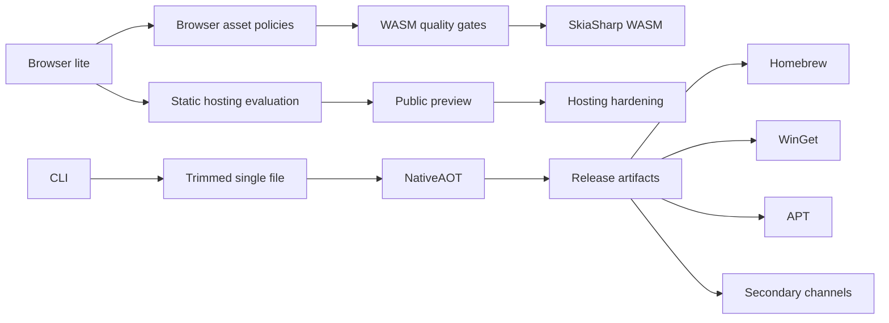

# PDF-to-HTML WASM, NativeAOT, Hosting, and Distribution Plan

This plan covers four related outcomes:

1. run a useful PDF-to-HTML converter entirely in a browser;
2. publish a trimmed, single-file command-line converter, using NativeAOT where practical;
3. host the browser application as a privacy-preserving static site; and
4. distribute command-line release artifacts through common package managers.

The GitHub roadmap is [issue #790](https://github.com/erikbra/pdfbox-net/issues/790).

## Product Boundaries

The first browser and command-line milestones use the lite dependency graph:

```text
PdfBox.Net.Html -> PdfBox.Net.Layout -> PdfBox.Net.Core
```

They do not reference `PdfBox.Net.Rendering`, `PdfBox.Net.SkiaSharp`, or
`PdfBox.Net.ImageMagick`. This is important for both browser compatibility and
trimming. The lite products must remain useful without a rendering backend and
must report unsupported operations instead of silently losing content.

SkiaSharp WASM is a later, optional fidelity layer. ImageMagick is not part of
the browser plan because the current Magick.NET package has desktop/server
native assets and no `browser-wasm` runtime asset.



## Workstream 1: Browser WASM

### Phase 1: browser lite

Tracked by [#782](https://github.com/erikbra/pdfbox-net/issues/782).

Deliver a standalone Blazor WebAssembly application that:

- accepts a local PDF through a browser file picker;
- reads the file into memory without uploading it;
- extracts layout with images and raster fallbacks disabled;
- creates continuous semantic HTML;
- inlines generated CSS and browser-safe assets into an iframe preview; and
- displays conversion time, page count, input size, and diagnostics.

Quality gates:

- Release publish succeeds for `browser-wasm`.
- A Playwright test uploads a deterministic PDF and finds expected text in the
  generated iframe.
- There are no network requests after the local file is selected.
- The resolved package graph contains no SkiaSharp or ImageMagick dependency.
- CI builds and publishes the browser sample.

The first capability contract is:

| Capability | Browser-lite status |
|---|---|
| Text and semantic grouping | Supported |
| Links and vector paths | Supported |
| Semantic AcroForm controls | Supported |
| Embedded TrueType/OpenType fonts | Supported when browser-loadable |
| Raw browser-safe images | Supported without a rendering backend |
| CMYK/YCCK JPEG and ICC conversion | Diagnostic/degraded |
| JPX/JPEG2000 and TIFF conversion | Diagnostic/degraded |
| Annotation appearance rasterization | Requires a browser rendering backend |
| Transparency-group raster fallback | Requires a browser rendering backend |

### Phase 2: browser-safe image policy

Completed by [unpdf #50](https://github.com/erikbra/unpdf/issues/50).

Add explicit strict, degraded, and backend-required policies. Preserve encoded
JPEG/PNG bytes when a browser can display them without decoding. Every omitted
asset must produce a stable diagnostic code.

The resulting contract preserves ordinary RGB JPEG streams byte-for-byte,
classifies CMYK/YCCK, JPX/JPEG2000, TIFF, and ICC failures, and reports missing
backends for requested annotation/transparency raster fallbacks. A dedicated
provider-free test project prevents desktop test registration from masking the
browser-lite behavior.

### Phase 3: payload and browser ratchets

Tracked by [#775](https://github.com/erikbra/pdfbox-net/issues/775).

Record raw and Brotli payload by asset, first-load time, conversion time, and
the largest tested input. Check in a baseline and fail CI only on unexplained
regressions. Published Blazor WebAssembly apps are trimmed and statically
compressed; the host must serve the precompressed assets correctly.

### Phase 4: SkiaSharp WASM

Tracked by [#779](https://github.com/erikbra/pdfbox-net/issues/779).

Create a separate browser backend or browser-specific target so desktop native
assets never leak into the WASM graph. Start with image decode/encode and only
the drawing operations needed by HTML fallbacks. Compare fidelity and payload
against browser lite before making it a default download.

The completed comparison is recorded in the
[browser deployment guide](pdf-html-wasm-pages.md#rendering-backends-and-loading).
Against the last browser-lite commit, the adaptive build adds 30.6% (about
1.17 MiB) to the Brotli framework payload, has equivalent single-run text
conversion time, and changes the browser image fixture from omitted/degraded to
exported and displayed. Checked-in payload and timing ratchets now guard the
accepted tradeoff.

Microsoft documents that WebAssembly native dependencies must be built for
WebAssembly and linked with the Emscripten toolchain. NuGet packages should use
`browser-wasm` runtime assets, and prebuilt native objects must match the SDK's
Emscripten version. See the [.NET native dependency guidance](https://learn.microsoft.com/en-us/aspnet/core/blazor/webassembly-native-dependencies?view=aspnetcore-10.0).

## Workstream 2: Single-file and NativeAOT CLI

### Phase 1: focused CLI

Tracked by [#776](https://github.com/erikbra/pdfbox-net/issues/776).

Create `unpdf` as a small executable project referencing the lite graph.
The initial default is continuous semantic HTML. It needs stable exit codes,
help/version output, overwrite behavior, diagnostics, and end-to-end tests.

### Phase 2: trim and single-file

Tracked by [#777](https://github.com/erikbra/pdfbox-net/issues/777).

Measure these builds separately:

1. framework-dependent baseline;
2. self-contained baseline;
3. trimmed self-contained;
4. trimmed, compressed single-file.

Enable trim and single-file analyzers. Resolve reflection and resource warnings
with source changes or narrow preservation rules. PDFBox glyph lists, AFM data,
CMaps, and other manifest resources require explicit regression coverage.

The target publish settings are:

```xml
<PublishTrimmed>true</PublishTrimmed>
<PublishSingleFile>true</PublishSingleFile>
<EnableCompressionInSingleFile>true</EnableCompressionInSingleFile>
<SelfContained>true</SelfContained>
```

See the official [.NET trimming](https://learn.microsoft.com/en-us/dotnet/core/deploying/trimming/trim-self-contained)
and [single-file](https://learn.microsoft.com/en-us/dotnet/core/deploying/single-file/overview)
documentation.

### Phase 3: NativeAOT

Tracked by [#778](https://github.com/erikbra/pdfbox-net/issues/778).

Enable AOT analyzers before `PublishAot`. The initial AOT product remains lite:
optional rendering backends are not dynamically loaded into an AOT process.
NativeAOT does not support dynamic assembly loading or runtime code generation,
and it requires trimming compatibility. See the official
[NativeAOT deployment guidance](https://learn.microsoft.com/en-us/dotnet/core/deploying/native-aot/).

The RID matrix should eventually cover:

| OS | Architectures | First artifact |
|---|---|---|
| Linux | x64, arm64 | NativeAOT, self-contained fallback if blocked |
| Windows | x64, arm64 where supported | NativeAOT, signed before stable release |
| macOS | x64, arm64 | NativeAOT, signed/notarized before stable release |

Each artifact must run the same deterministic conversion fixture. Record size,
startup, conversion time, and output hash/structural equivalence.

### Phase 4: release contract

Tracked by [#780](https://github.com/erikbra/pdfbox-net/issues/780).

GitHub Releases become the immutable source for package managers. Artifacts use
stable names, include license/notices, publish SHA-256 checksums and an SBOM,
and are smoke-tested on their native runner. Signing state must be explicit.

## Workstream 3: WASM Hosting

Tracked by [#784](https://github.com/erikbra/pdfbox-net/issues/784),
[#783](https://github.com/erikbra/pdfbox-net/issues/783), and
[#785](https://github.com/erikbra/pdfbox-net/issues/785).

The first GitHub Pages preview is documented in
[PDF-to-HTML Browser Preview](pdf-html-wasm-pages.md).

A standalone Blazor WebAssembly app is a set of static files and does not need
a .NET server. Microsoft explicitly supports static/CDN hosting for this model.
See the [Blazor hosting-model documentation](https://learn.microsoft.com/en-us/aspnet/core/blazor/hosting-models?view=aspnetcore-10.0).

The limits below were checked against the linked primary documentation on
2026-07-17. Provider pricing and quotas remain external state and must be
rechecked before a production migration.

| Option | Current limits and cost | Setup and security control | Recommendation |
|---|---|---|---|
| GitHub Pages | Free for this public repository; 1 GB published-site limit, soft 100 GB/month bandwidth limit, and a 10-minute deployment timeout. Custom Actions publication avoids the ordinary ten-builds-per-hour soft limit. | Already deployed with repository TLS and no new account. Correct WASM MIME serving is verified, but arbitrary response security/cache headers cannot be configured; the app therefore uses a verified CSP meta policy for the preview. | Keep as the zero-infrastructure public demo/preview. GitHub states that Pages is not intended to run commercial SaaS, reinforcing the preview-only boundary. |
| Azure Static Web Apps | Free: 250 MB per environment, 500 MB total, 15,000 files, three preview environments, two custom domains, and 100 GB/month with no overage. Standard: 500 MB per environment, 2 GB total, ten preview environments, 100 GB included, then documented bandwidth overage; the base plan price is region/account dependent. | Azure resource plus deployment token or GitHub integration. `staticwebapp.config.json` supports global and route response headers; generated output includes this config. Standard supplies an SLA and additional production controls. | Viable when Azure ownership, support, or an SLA is desired. |
| Cloudflare Pages | Free: 500 builds/month, 20,000 files/site, 25 MiB per asset, one concurrent build, 100 custom domains, and unlimited active preview deployments. Paid plans raise build and file-count limits. | Git or direct upload. A generated `_headers` file applies CSP and other response headers without a function or upload API. The current largest browser asset is below the 25 MiB per-file limit. | Preferred first production candidate for this static, client-only app because it can consume the host-neutral artifact and enforce the checked response-header policy directly. |
| Static object storage plus CDN or self-hosted Nginx | Limits and cost depend on the selected storage, egress, CDN, TLS, and logging products. | Highest control over headers, caching, domains, logs, and regional placement, but requires infrastructure, monitoring, TLS renewal, and incident ownership. | Keep as the vendor-neutral escape hatch when operational control justifies the maintenance cost. |

Recommendation:

- Keep GitHub Pages for the public preview because it is low-friction and keeps
  the demo next to the repository.
- Use Cloudflare Pages as the first production candidate if a production public
  service is needed; its static `_headers` support matches the generated
  artifact without introducing server code. Azure Static Web Apps remains the
  alternative when Azure ownership or an SLA is important.
- Keep deployment output host-neutral: publish `wwwroot` as static files, with
  no host SDK in the application.
- No option needs or receives a PDF upload endpoint.

Relevant primary documentation:

- [Blazor WebAssembly on GitHub Pages](https://learn.microsoft.com/en-us/aspnet/core/blazor/host-and-deploy/webassembly/github-pages?view=aspnetcore-10.0)
- [GitHub Pages custom Actions deployment](https://docs.github.com/en/pages/getting-started-with-github-pages/configuring-a-publishing-source-for-your-github-pages-site)
- [Blazor WebAssembly on Azure Static Web Apps](https://learn.microsoft.com/en-us/aspnet/core/blazor/host-and-deploy/webassembly/azure-static-web-apps?view=aspnetcore-10.0)
- [Cloudflare Pages](https://developers.cloudflare.com/pages/)
- [GitHub Pages limits](https://docs.github.com/en/pages/getting-started-with-github-pages/github-pages-limits)
- [Azure Static Web Apps quotas](https://learn.microsoft.com/en-us/azure/static-web-apps/quotas)
- [Azure Static Web Apps plans](https://learn.microsoft.com/en-us/azure/static-web-apps/plans)
- [Azure Static Web Apps configuration](https://learn.microsoft.com/en-us/azure/static-web-apps/configuration)
- [Cloudflare Pages limits](https://developers.cloudflare.com/pages/platform/limits/)
- [Cloudflare Pages custom headers](https://developers.cloudflare.com/pages/configuration/headers/)

Production hardening must verify CSP/security headers, correct WebAssembly MIME
types and Brotli/Gzip delivery, immutable fingerprinted caching, SPA fallback,
large-file cancellation/memory behavior, and content-safe telemetry. No host
needs or receives the source PDF.

## Workstream 4: Command-line Distribution

Package-manager metadata consumes the release contract from #780. It does not
build a subtly different executable.

### Homebrew

Tracked by [#786](https://github.com/erikbra/pdfbox-net/issues/786).

Start with a project-owned tap. A formula selects the release artifact by OS and
architecture, verifies SHA-256, installs the executable, and runs a real
conversion in `brew test`. A later homebrew-core submission can be considered
after releases are stable. See the official
[Homebrew Formula Cookbook](https://docs.brew.sh/Formula-Cookbook).

### WinGet

Tracked by [#787](https://github.com/erikbra/pdfbox-net/issues/787).

Generate and validate manifests against immutable Windows release URLs. Test
install, PATH, conversion, upgrade, and uninstall on Windows. External
submission remains a reviewable PR to `microsoft/winget-pkgs`; automation must
not submit it silently. See Microsoft's [manifest creation](https://learn.microsoft.com/en-us/windows/package-manager/package/manifest)
and [repository submission](https://learn.microsoft.com/en-us/windows/package-manager/package/repository)
guidance.

### Debian and APT

Tracked by [#788](https://github.com/erikbra/pdfbox-net/issues/788).

Create architecture-specific `.deb` packages with standard paths, metadata,
license/notices, and a man page. Publish signed package indices to a test APT
repository and test install/upgrade/remove in Debian and Ubuntu containers. An
official Debian archive submission is a separate, longer-term process. See the
[Debian packaging introduction](https://wiki.debian.org/Packaging/Intro) and
[repository overview](https://wiki.debian.org/DebianRepository/).

### Secondary channels

Tracked by [#789](https://github.com/erikbra/pdfbox-net/issues/789).

The completed [secondary-channel comparison](unpdf-secondary-distribution-channels.md)
selects Scoop as the next low-maintenance channel after stable Windows
Authenticode signing is available. Chocolatey, Snap, AUR, containers, and a
direct installer are deferred because they currently add more moderation,
payload, or support cost than audience value. Checksummed release archives
remain the package-manager-independent fallback.

## Delivery Order

1. Complete browser-lite issue #782.
2. Build the CLI in #776.
3. Use real products to complete browser asset policy and trim analysis.
4. Add payload and NativeAOT gates.
5. Establish immutable release artifacts.
6. Deploy the static preview and harden hosting.
7. Publish Homebrew, WinGet, and APT metadata in that order.
8. Add secondary distribution only after update automation is reliable.

Each issue is delivered on its own branch with local tests before CI. Dependent
issues start only after their prerequisite behavior is merged and measured.
